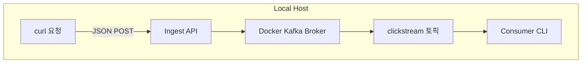

> 최소한의 비용을 지불하면서 카프카 사용해보기. 일단 MSK Serverless로!

이제 본격적으로 카프카 클러스터를 구성하고 로그 데이터를 수신할 수 있도록 세팅해보려고 합니다. 여기서 제가 가장 중요하게 생각한건 **비용** 입니다. 우선 카프카의 구성을 직접 익히고 어떤 방식으로 쓰는지 알기 위해 하는 PoC인 만큼 설치와 운영에 드는 비용을 많이 감당할 수 없어서...
EC2 대신, EKS 대신, MSK Serverless를 사용해보려고 합니다!

## 🎯 이번 글 목표

1. **로컬 Kafka 환경 구축**  
   Docker Compose로 Zookeeper와 Kafka 단일 노드 클러스터를 띄우고, `clickstream` 토픽을 생성해 기본 프로듀서·컨슈머 테스트를 수행.

2. **람다 프로듀서 로컬 검증**  
   로컬 Kafka 클러스터 위에서 Lambda 함수를 시뮬레이션 실행하여, 컨슈머를 통해 실제 메시지 수신 여부를 확인.

3. **AWS MSK Serverless 통합 및 검증**  
   - MSK Serverless 클러스터 생성  
   - Lambda 함수가 MSK에 접근할 수 있도록 VPC, 보안그룹, IAM 권한을 설정  
   - 프로덕션 환경에서 호출 테스트 및 CloudWatch 메트릭으로 모니터링  

### 1. 로컬 Kafka 환경 구축
다음과 같은 구성으로 진행됩니다.

- curl 요청: curl 명령으로 이벤트(JSON)를 보내는 역할
- Ingest API: fastapi로 구현된 kafka 전송 서버
- Docker Kafka: Zookeeper + Kafka 브로커
- clickstream 토픽: 메시지 저장소
- Consumer CLI: 터미널에서 메시지를 실시간으로 읽어 확인

#### 1.1 Docker Compose 파일 작성
단일 로컬 카프카 클러스터 구축을 위해서 도커 컴포즈 파일 작성 후 실행합니다.
```yml
```