> **최소한의 비용을 지불하면서 카프카 사용해보기**


이제 본격적으로 **카프카 클러스터**를 구성하고 로그 데이터를 수신할 수 있도록 세팅해보려고 합니다.  
여기서 제가 가장 중요하게 생각한 건 **비용**입니다.  
카프카의 구성을 직접 익혀보고 어떤 방식으로 쓰는지 알기 위한 PoC이기 때문에,  
설치와 운영에 드는 비용을 최대한 줄이고자 **EKS, MSK 같은 매니지드 서비스를 쓰지 않고 직접 EC2 인스턴스에 카프카를 띄워서 사용**하기로 했습니다!

---

## 🎯 이번 글 목표

1. **로컬 Kafka 환경 테스트**  
   - Docker Compose로 Zookeeper와 Kafka 단일 노드 클러스터를 띄우고, `clickstream` 토픽을 생성해 **기본 프로듀서·컨슈머 테스트**를 수행  
   - 로컬 Kafka 클러스터 위에서 프로듀서 API를 시뮬레이션 실행하여, 컨슈머를 통해 실제 메시지 수신 여부를 확인

2. **EC2 기반 Kafka 클러스터 구축 및 검증**  
   - AWS EC2 인스턴스에 직접 Zookeeper와 Kafka를 설치  
   - **보안그룹, 네트워크 등 기본 인프라 설정**  
   - 외부에서 접근 가능한지 테스트 및 운영 환경에서의 메시지 송수신 검증

---

### 1. 로컬 Kafka 환경 구축
다음과 같은 구성으로 진행됩니다.

```mermaid
flowchart TB
  subgraph "Local Host"
    A["curl 요청"] -- "JSON POST" --> B["Ingest API"]
    B --> C["Docker Kafka Broker"]
    C --> D["clickstream 토픽"]
    D --> E["Consumer CLI"]
  end
```

- curl 요청: curl 명령으로 이벤트(JSON)를 보내는 역할
- Ingest API: fastapi로 구현된 kafka producer
- Docker Kafka: Zookeeper + Kafka 브로커
- clickstream 토픽: 메시지 저장소
- Consumer CLI: 터미널에서 메시지를 실시간으로 읽어 확인

---

#### 1.1 Docker Compose 파일 작성 및 실행
카프카 클러스터 구축을 위해서 도커 컴포즈 파일 작성 후 실행합니다.
```yml
# docker-compose.yml
version: '3.8'
services:
  zookeeper:
    image: confluentinc/cp-zookeeper:7.4.1
    environment:
      ZOOKEEPER_CLIENT_PORT: 2181

  kafka:
    image: confluentinc/cp-kafka:7.4.1
    depends_on:
      - zookeeper
    environment:
      KAFKA_BROKER_ID: 1
      KAFKA_ZOOKEEPER_CONNECT: zookeeper:2181
      KAFKA_ADVERTISED_LISTENERS: PLAINTEXT://localhost:9092
      KAFKA_OFFSETS_TOPIC_REPLICATION_FACTOR: 1
    ports:
      - "9092:9092"
```
- **zookeeper?**
    - 아파치에서 만든 **분산 코디네이션 서비스**입니다.
    - 카프카 클러스터에서 브로커 간의 **메타데이터 관리, 리더 선출, 구성원 변화 감지** 등을 담당해요. (카프카는 메시지 저장을 담당하고, 어떤 파티션이 몇 개며 어디에 위치하는지 같은 정보는 주키퍼에 보관)
- 카프카 브로커가 시작하면서 "내가 클러스터의 일원"임을 주키퍼에 등록하고 기존 브로커들과 토픽, 파티션 메타데이터를 주고 받습니다.
- 리스너는 PLAINTEXT로 암호화나 인증 없이 연결합니다.

`docker-compose up -d` 실행시 백그라운드에 띄워집니다.

---

#### 1.2 토픽 생성
```bash
docker exec -it clickstream-test-kafka-1 \
  kafka-topics --create \
    --topic clickstream \
    --bootstrap-server localhost:9092 \
    --partitions 1 \
    --replication-factor 1
```
- 단순 테스트용으로 파티션과 복제는 하나만 생성합니다.

---

#### 1.3 Producer 코드 작성
다음과 같은 fastapi 코드를 작성해 producer 역할을 하도록 합니다.
```python
# ingest_kafka.py
from fastapi import FastAPI, Request
from fastapi.middleware.cors import CORSMiddleware
from confluent_kafka import Producer
import os, logging, json

logging.basicConfig(level=logging.INFO)
app = FastAPI()

app.add_middleware(
    CORSMiddleware,
    allow_origins=["*"],
    allow_methods=["*"],
    allow_headers=["*"],
)

producer = Producer({'bootstrap.servers': os.getenv('BOOTSTRAP_SERVERS', 'localhost:9092')})

@app.post("/ingest")
async def ingest(request: Request):
    evt = await request.json()
    logging.info(f"Received click event: {evt}")
    producer.produce("clickstream", json.dumps(evt).encode("utf-8"))
    producer.flush()
    return {"status":"ok", "received":evt}
```
이제 이 코드를 `uvicorn ingest_kafka:app --host 0.0.0.0 --port 8000`로 로컬에서 실행시켜두었습니다. 해당 api로 post 요청을 보내면 메시지가 생성됩니다.

---

#### 1.4 Consumer 실행
이제 카프카의 컨슈머를 실행해 로그를 살펴봅니다.
```bash
docker exec -it clickstream-test-kafka-1 \
  kafka-console-consumer \
    --bootstrap-server localhost:9092 \
    --topic clickstream --from-beginning
```
해당 코드로 컨슈머를 실행시킨 상태에서, 아까 띄워둔 producer 역할을 하는 api에 curl 명령을 보내 메시지를 생성합니다.
```bash
# 예시
curl -X POST http://localhost:8000/ingest \
  -H "Content-Type: application/json" \
  -d '{"path":"/foo","tag":"BUTTON","id":"btn1","timestamp":"2025-05-22T09:45:00Z"}'
```
그럼 카프카의 컨슈머에 해당 메시지가 전달되어 출력됩니다.


> 로컬 테스트 완료!

---

### 2. EC2 기반 Kafka 클러스터 구축 및 검증

이제 로컬 테스트를 마쳤으니, Terraform으로 프로비저닝한 EC2 인스턴스 위에 Kafka 클러스터를 배포하고 외부에서 로그를 수신하는 과정을 진행합니다.

---

#### 2.1 EC2 인프라 코드 (Terraform)
EC2 인스턴스를 Terraform으로 프로비저닝하고, User Data를 통해 Zookeeper와 Kafka를 자동으로 설치하고 이를 AMI로 만들어 둡니다.
테라폼은 사전 설치 되어있고 aws 접근을 위한 권한을 갖추기 위해 테라폼 전용 사용자를 생성합니다.

> 처음부터 최소 권한을 준수하면서 테라폼을 실행시키면 권한 문제 에러가 자주 발생합니다. [일단 전체 권한을 준 뒤에 CloudTrail 활동을 기반으로 선별된 정책으로 권한을 축소하는 방법도 있으니 참고해주세요.](https://docs.aws.amazon.com/IAM/latest/UserGuide/access-analyzer-policy-generation.html?utm_source=chatgpt.com#access-analyzer-policy-generation-api) 
{: .prompt-danger }

1. EC2 프로비저닝을 위한 최소 권한 `TerraformKafkaEC2Provisioning` 생성
2. 해당 권한을 추가한 사용자(terraform) 생성
3. 사용자 보안 자격 증명 > 엑세스 키 생성
<div style="display: flex; justify-content: center; gap: 2%; align-items: flex-start;">
  
  
</div>

이제 생성한 엑세스 키를 개발 서버에 `aws configure` 적용하고 해당 서버에서 테라폼 코드를 실행시키게 됩니다.

- 기존에 있던 VPC, Subnet 사용. security group 만들기 (포트번호 22:ssh, 2181:zookeeper, 9092:kafka 인바운드 허용)
- EC2 생성시에 EBS 생성 (영구 볼륨)

> 기존 계획에는 프라이빗 서브넷에 설치하고자 했으나 ec2 내부에 원하는 패키지 설치가 어려워서 퍼블릭 서브넷에서 설치하고 초기 세팅을 마친 뒤 AMI로 만들어서 사용했습니다.
{: .prompt-tip}

---

#### 2.2 EC2에 카프카 설치 및 동작
카프카를 설치하기 위한 bash 스크립트입니다. 로컬에서 테스트한 버전과 동일하게 설정했고 EC2 AMI는 아마존 리눅스 2를 사용했습니다.
```bash
#!/bin/bash
# 1) 시스템 업데이트
yum update -y

# 2) Java 설치 (OpenJDK 11)
amazon-linux-extras install java-openjdk11 -y

# 3) Confluent Platform 7.4.1 다운로드 및 설치
wget https://packages.confluent.io/archive/7.4/confluent-community-7.4.1.tar.gz -P /opt
tar xzf /opt/confluent-community-7.4.1.tar.gz -C /opt
ln -s /opt/confluent-7.4.1 /opt/confluent

# 4) Kafka 브로커 설정
sed -i 's|^#listeners=.*|listeners=PLAINTEXT://0.0.0.0:9092|' /opt/confluent/etc/kafka/server.properties
sed -i 's|^#advertised.listeners=.*|advertised.listeners=PLAINTEXT://'"$(curl -s http://169.254.169.254/latest/meta-data/public-ipv4)"':9092|' /opt/confluent/etc/kafka/server.properties

# 5) Zookeeper, Kafka 실행
CONFLUENT_DIR=/opt/confluent
ZOOKEEPER_PROP=$CONFLUENT_DIR/etc/kafka/zookeeper.properties
KAFKA_PROP=$CONFLUENT_DIR/etc/kafka/server.properties
ZK_BIN=$CONFLUENT_DIR/bin/zookeeper-server-start
KAFKA_BIN=$CONFLUENT_DIR/bin/kafka-server-start

sudo $ZK_BIN -daemon $ZOOKEEPER_PROP
sudo $KAFKA_BIN -daemon $KAFKA_PROP
```

이렇게 실행하게 되면 매번 수동으로 명령을 실행해야해 서비스로 등록하도록 아래 작업을 진행했습니다. systemd 서비스 파일을 생성하고 enable만 해놓으면 부팅시에 자동으로 시작됩니다.

```bash
# 6) systemd 서비스 파일 생성
cat << 'EOT' > /etc/systemd/system/zookeeper.service
[Unit]
Description=Apache Zookeeper
After=network.target

[Service]
Type=simple
ExecStart=/opt/confluent/bin/zookeeper-server-start /opt/confluent/etc/kafka/zookeeper.properties
Restart=on-failure

[Install]
WantedBy=multi-user.target
EOT

cat << 'EOT' > /etc/systemd/system/kafka.service
[Unit]
Description=Apache Kafka
After=zookeeper.service

[Service]
Type=simple
ExecStart=/opt/confluent/bin/kafka-server-start /opt/confluent/etc/kafka/server.properties
Restart=on-failure

[Install]
WantedBy=multi-user.target
EOT

# 7) 서비스 등록 및 시작
sudo systemctl daemon-reload
sudo systemctl enable zookeeper.service kafka.service
sudo systemctl start zookeeper.service kafka.service
```

> 주키퍼(2181), 카프카(9092)의 포트 모두 동작하고 있다..!


---

#### 2.3 카프카 토픽 생성 및 프로듀서/컨슈머 테스트
```bash
/opt/confluent/bin/kafka-topics \
  --create \
  --topic clickstream \
  --bootstrap-server 0.0.0.0:9092 \
  --partitions 1 \
  --replication-factor 1
```
이렇게 토픽을 생성한 후 프로듀서에 메시지를 보내고, 컨슈머에 메시지를 잘 받아오는지 아래와 같이 확인했습니다.
```bash
# Producer
/opt/confluent/bin/kafka-console-producer --broker-list localhost:9092 --topic clickstream  
# Consumer
/opt/confluent/bin/kafka-console-consumer --bootstrap-server localhost:9092 --topic clickstream --from-beginning
```
> EC2에서도 로컬과 동일한 테스트 완료!


---

## 🚀 결론 및 다음 단계

이번 글에서는 **로컬 Docker Compose**, **EC2 기반 설치**, **systemd 서비스 등록**을 통해 최소 비용으로 Kafka 단일 브로커 환경을 띄워보고, 토픽 생성과 프로듀서·컨슈머 테스트까지 완료했습니다. 직접 설치·운영 과정을 경험하며 Kafka의 내부 동작 원리를 이해하고, 부트스트랩·리스너 설정, Zookeeper 연동, systemd를 이용한 자동 기동 방법을 익혔습니다.

앞으로는 이 PoC를 확장하여 **데이터 파이프라인**을 완성하는 단계로 나아갑니다:

1. **Lambda → Kafka 연동**  
   - 앞서 만든 Ingest API를 AWS Lambda로 이전하고, VPC 설정을 통해 Kafka 브로커로 직접 프로듀싱  
2. **배치 저장소 구성**  
   - Kafka Connector 또는 커스텀 스크립트를 이용해 S3·HDFS에 주기적 데이터 적재  
3. **분석 환경 구축**  
   - Spark 또는 Flink 클러스터를 연동해 실시간·배치 분석 워크플로우 구현  
4. **실시간 시각화**  
   - Grafana/QuickSight와 연동하여 클릭스트림 대시보드 제작  
5. **확장 & 운영 안정화**  
   - 다중 브로커·파티션 분할을 통한 가용성 개선  
   - Prometheus·CloudWatch 기반 모니터링·알람 설정  

다음 글에서는 **AWS Lambda를 활용한 Kafka 프로듀싱**, **S3 배치 적재** 과정을 중심으로 단계별 코드 예제와 Terraform 설정을 공유드리겠습니다. 

## 참고 자료
- [Kafka Cluster with Docker Compose](https://medium.com/%40erkndmrl/kafka-cluster-with-docker-compose-5864d50f677e)
- [Install Apache Kafka in AWS EC2 Instance](https://medium.com/%40nimeshaamarasingha/install-apache-kafka-in-aws-ec2-instance-d530c387d265)
- [Use Confluent Platform systemd Service Unit Files](https://docs.confluent.io/platform/current/installation/installing_cp/scripted-install.html)
