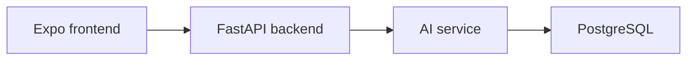

6월에는 ARCHIVO라는 서비스를 시작했다. 인터넷에서 발견한 링크를 저장하고 내용을 요약한 후 카테고리로 정리해주는 앱이다. 프로젝트를 시작한 뒤 기본 구조를 만들고 AI 처리와 문서 관리 기능을 붙였다. 실제로 써보며 화면을 다듬은 과정을 적어본다.

## 1. ARCHIVO의 시작: 링크를 저장하고 정리하는 서비스

6월에는 ARCHIVO라는 새로운 서비스를 시작했다. 

<!-- 이미지 삽입 위치: ARCHIVO의 링크 등록부터 AI 분류, 저장까지 전체 구조도 -->

Remindy를 만들면서 해야 할 일을 잊지 않도록 돕는 문제를 다뤘다면 ARCHIVO에서는 나중에 다시 보고 싶은 정보를 잃지 않도록 저장하는 문제를 다루게 되었다. 두 서비스 모두 사용자가 기억과 정보를 외부 시스템에 맡긴다는 공통점이 있었다.

### 서비스 구조

ARCHIVO는 다음 세 개의 주요 서비스로 구성했다.



사용자가 링크를 등록하면 백엔드가 ingest 작업을 만들고 AI 서비스가 본문 추출, 요약, 분류를 수행한다. 결과는 다시 백엔드에 저장되고 프론트엔드에서 문서 목록으로 확인한다.

### 처음부터 레포를 나누었다

백엔드, 프론트엔드, AI 서비스, 배포 설정, 디자인, 문서, 회의록을 각각의 레포로 분리하고 workspace에서 submodule로 관리했다. 프로젝트가 커질수록 코드와 운영 문서가 서로 다른 속도로 변하기 때문에 각 영역의 책임을 분리할 필요가 있었다.

개발 환경은 Docker Compose와 Expo를 이용해 로컬에서 전체 흐름을 실행할 수 있도록 구성했다. 서비스 하나만 실행하는 것이 아니라 실제 사용자 흐름을 처음부터 끝까지 확인하기 위한 구조다.

### 이름을 바꾸며 다시 시작하다

초기 프로젝트 이름을 ARCHIVO로 정리하면서 로고, 색상, 문서, 저장소 이름도 함께 맞추었다. 이름을 바꾸는 작업은 단순한 문자열 수정이 아니라 제품의 방향과 저장소 구조를 다시 확인하는 과정이었다.

아직 시작 단계지만 나중에 읽을 링크를 잊지 않게 저장한다는 단순한 문제를 실제로 쓸 수 있는 제품으로 만들어보고 있다.

### 처음부터 운영을 생각한 이유

링크 저장 서비스는 URL을 받아 처리하는 것처럼 보이지만 실제로는 외부 사이트의 응답과 본문 구조에 영향을 많이 받는다. 따라서 로컬 개발 환경에서 frontend, backend, AI service를 함께 실행하고 실패 상황을 확인할 수 있어야 했다.

배포 레포와 운영 문서 레포를 별도로 둔 것도 같은 이유였다. 기능을 만드는 사람과 배포를 담당하는 사람이 서로 다른 정보를 갖지 않도록 환경변수, health check, 실행 방법을 문서로 남기기 시작했다.

### 레포지토리별 책임

ARCHIVO workspace는 여러 서비스 레포를 한곳에서 실행하고 최신 상태를 맞추는 역할을 한다.

| 레포 | 책임 |
|---|---|
| frontend | 링크 등록, 목록, 상세, 설정 화면 |
| backend | 인증, 문서, 카테고리 API, ingest 작업 |
| ai-service | 본문 추출, 요약, 분류 |
| deploy | Docker Compose와 운영 배포 |
| docs | 스펙, QA, 런북 |

이렇게 나누면 코드의 책임은 명확해지지만 여러 레포의 버전이 서로 맞아야 한다. workspace의 submodule 포인터를 갱신하는 작업도 기능 개발의 일부가 되었다.

처음에는 레포를 나누는 것이 번거롭게 느껴졌지만 프로젝트가 커질수록 문서와 배포 설정이 코드에 묻히지 않는 장점이 더 크게 느껴졌다.

## 2. ARCHIVO의 핵심 기능 구현하기

ARCHIVO의 기본 구조를 만든 뒤에는 실제로 사용할 수 있는 기능을 빠르게 채웠다. 링크를 저장하는 것에서 끝나지 않고, 나중에 다시 찾고 관리할 수 있어야 했다.

<div style="display: flex; gap: 1rem; justify-content: center; flex-wrap: wrap;">
  
  
  
</div>

### AI로 링크를 정리하다

AI 서비스는 URL에서 대표 본문을 추출하고 내용을 요약한 뒤 사용자의 카테고리 후보에 맞춰 분류한다. Jina를 통한 본문 추출이 실패했을 때는 링크 미리보기로 넘어가는 fallback도 추가했다.

```text
URL 입력
  → 본문 추출
  → 요약
  → 카테고리 후보 생성
  → 사용자 카테고리와 매칭
  → 문서 저장
```

AI 결과는 항상 성공한다고 가정하지 않았다. CAPTCHA 때문에 본문을 가져올 수 없거나 영상 제목만 얻을 수 있는 경우도 있어 결과의 상태를 구분해 저장했다.

### 문서 관리 기능

백엔드에는 사용자 카테고리 관리 API와 다중 카테고리 저장 모델을 추가했다. 실수로 삭제한 문서를 복구할 수 있도록 soft delete와 휴지통, 일정 기간이 지난 문서를 정리하는 배치 정책도 마련했다.

프론트엔드에서는 링크 저장 후 목록을 즉시 갱신하고 제목을 직접 수정할 수 있도록 했다. AI가 만든 결과를 사용자가 수정할 수 있어야 서비스가 실제로 편리해진다.

### 배포와 검증

AWS Lightsail 기반 운영 인프라와 Docker Compose 배포 구성을 정리하고 TestFlight 배포 런북과 QA 체크리스트를 문서화했다. 기능 구현과 함께 배포 방법을 기록해두면 다음 릴리스에서 같은 시행착오를 반복하지 않을 수 있다.

ARCHIVO는 AI가 모든 것을 대신 정리하는 서비스라기보다 사용자의 저장 습관을 줄이고 나중에 다시 찾는 비용을 낮추는 서비스에 가깝다. 그래서 자동화와 사용자의 수정 가능성을 함께 설계하고 있다.

### 실패를 데이터로 남기기

본문 추출 실패를 단순한 예외로 버리지 않고 CAPTCHA나 영상 링크처럼 원인을 구분하려고 했다. 그래야 사용자는 링크 자체가 저장되지 않은 것인지 본문만 가져오지 못한 것인지 이해할 수 있다.

AI 분류도 단일 카테고리만 반환하는 구조에서 여러 카테고리를 저장할 수 있는 구조로 확장했다. 사용자의 지식은 하나의 분류로 완전히 나뉘지 않는 경우가 많기 때문이다.

이런 기능을 추가하면서 자동화된 결과를 저장할 때는 결과뿐 아니라 처리 상태와 실패 이유도 함께 남겨야 한다는 것을 알게 되었다.

### 데이터 모델이 제품 경험을 결정한다

문서 하나에 제목, 원본 URL, 요약, 카테고리, 처리 상태, 삭제 여부가 함께 존재한다. 처음에는 링크와 제목만 저장하면 된다고 생각했지만 AI 처리와 휴지통을 추가하면서 상태를 표현하는 필드가 필요해졌다.

```text
입력됨 → 처리 중 → 완료
              └→ 본문 추출 실패
              └→ 분류 실패
완료 → 삭제됨 → 복구 또는 영구 정리
```

상태를 명확히 분리해두면 프론트엔드는 사용자가 현재 어떤 단계에 있는지 보여줄 수 있고 백엔드는 실패한 작업만 다시 처리할 수 있다.

ARCHIVO는 링크를 저장하는 CRUD 앱에서 시작했지만, 실제로는 외부 데이터 수집과 AI 처리, 사용자 수정, 보관 정책이 함께 있는 작은 파이프라인으로 발전하고 있다.

## 3. ARCHIVO를 실제로 쓰기 위한 UX 다듬기

기능이 동작하기 시작한 뒤에는 화면 곳곳의 작은 불편을 줄이는 작업을 진행했다. 링크를 저장할 수 있다는 것과 저장한 링크를 편하게 관리할 수 있다는 것은 다른 문제였다.

<!-- 이미지 삽입 위치: UX 개선 전, 후 화면 비교 또는 링크 저장 흐름 캡처 -->

### 저장 직후의 피드백

링크를 등록하고도 목록에 바로 보이지 않으면 저장이 실패한 것처럼 느껴진다. 그래서 저장 완료 후 목록을 즉시 갱신하고, 완료 토스트를 보여주도록 했다.

제목도 AI가 추출한 값만 사용하는 것이 아니라 사용자가 직접 override할 수 있도록 했다. 자동화된 결과가 항상 사용자의 의도와 일치하지는 않기 때문이다.

### QA 체크리스트를 문서화하다

링크 저장, 제목 수정, 목록 갱신, 카테고리 변경, 삭제와 복구 같은 흐름을 QA 체크리스트로 남겼다. 구현자가 기억하는 정상 경로만으로는 제품을 안정적으로 검증하기 어렵다.

ARCHIVO는 아직 계속 변하는 단계지만 기능을 빠르게 추가하는 것과 같은 속도로 사용 흐름을 정리하는 일이 중요하다는 것을 다시 확인했다.

### 자동화가 만든 결과를 다시 사람이 확인하기

AI가 만든 제목과 요약은 빠르게 저장하기에는 편리하지만 항상 적절하지는 않다. 그래서 제목 override와 상세 화면의 콘텐츠 접기처럼 사용자가 결과를 확인하고 수정하는 기능을 함께 추가했다.

저장 완료 토스트와 목록 즉시 갱신도 같은 맥락이었다. 시스템이 실제로 무엇을 했는지 사용자가 바로 알 수 있어야 자동화된 기능을 믿고 사용할 수 있다.

작은 UI 수정처럼 보이는 작업이었지만 기능을 많이 넣는 것보다 사용자가 다음 행동을 망설이지 않게 만드는 일이 더 중요했다.

### QA에서 확인한 사용자 시나리오

이번에는 기능별로 따로 확인하기보다 사용자가 실제로 밟는 순서대로 테스트했다.

| 시나리오 | 확인할 것 |
|---|---|
| 링크 등록 | 저장 버튼, 로딩, 완료 피드백 |
| 저장 직후 | 목록에 새 문서가 바로 나타나는지 |
| 제목 수정 | 수정값이 상세와 목록에 모두 반영되는지 |
| 긴 문서 확인 | 접기와 펼치기가 자연스럽게 동작하는지 |
| 삭제, 복구 | 실수 방지와 복구 가능 여부 |

정상적으로 한 번 저장되는 것만 확인하면 부족했다. 같은 작업을 빠르게 반복하거나, 키보드가 열린 상태에서 저장하거나, AI 응답이 늦은 경우도 함께 확인해야 했다.

제품을 다듬는 일은 화면을 예쁘게 만드는 것보다 사용자의 행동이 끊기는 지점을 찾아 없애는 일에 더 가까웠다.

---

ARCHIVO는 링크를 저장하는 기능에서 시작해 AI 처리와 카테고리, 휴지통, 배포와 QA까지 하나씩 붙여가고 있다. 자동으로 정리해주는 서비스이지만 마지막에 결과를 확인하고 고치는 사람의 흐름도 함께 남겨두는 방향으로 만들어가려고 한다.

끝!
