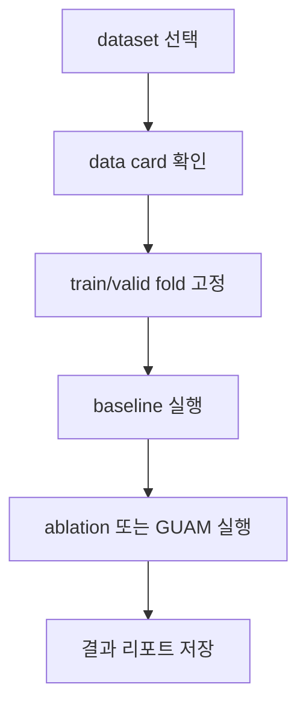

RAPIDS와 AutoGluon을 공부한 뒤 GPU 위에서 동작하는 AutoML 라이브러리를 직접 만들어보기로 했다. 프로젝트의 기본 구조와 모듈 계약을 정하고, 같은 조건에서 모델을 비교하기 위한 벤치마크 러너를 만든 과정을 적어본다.

## 1. GUAM 프로젝트의 기반 만들기

RAPIDS와 AutoGluon을 공부한 뒤 GPU 위에서 동작하는 AutoML 라이브러리를 직접 만들어보기로 했다. 프로젝트 이름은 GUAM이며 GPU-based Auto-ML for Robust Large Scale Computation의 약자다.


처음부터 모든 모델을 구현하려고 하면 기능 간 의존성이 빠르게 복잡해질 수 있다. 그래서 먼저 각 모듈이 무엇을 보장해야 하는가를 정하고 그 계약을 만족하는 가장 작은 구현부터 쌓는 방식으로 접근했다.

### 만들고 싶은 구조

GUAM은 LightAutoML의 구조를 참고해 데이터 준비부터 모델 학습, 평가, 앙상블까지 이어지는 파이프라인을 GPU 중심으로 구현하는 것을 목표로 한다.

```text
Raw data
  → Reader
  → Dataset / ColumnRole
  → Transformer
  → ML Algorithm
  → Validation
  → Stacking / Blender
  → Prediction
```

중요한 원칙은 데이터가 GPU에 올라간 뒤 최종 출력까지 가능한 한 GPU에 남아 있는 것이다. 중간에 pandas나 CPU 기반 metric으로 변환하면 데이터 이동 비용과 실행 경계가 복잡해진다.

### 처음부터 계약을 정의했다

기능을 바로 구현하기보다 각 모듈이 어떤 입력과 출력을 가져야 하는지 먼저 정리했다.

- Dataset은 어떤 데이터를 표현하는가
- Reader는 어떤 입력 형식을 지원하는가
- Transformer는 어떤 계약을 지키는가
- MLAlgo는 학습과 예측을 어떻게 노출하는가
- Validation은 train/valid 쌍을 어떻게 제공하는가

이 계약을 ABC와 테스트로 남겨두면 구현체가 늘어나도 전체 파이프라인의 형태가 흔들리지 않는다.

### 프로젝트 운영도 함께 설계했다

GUAM은 여러 사람이 함께 만드는 프로젝트였기 때문에 코드만큼 협업 규칙과 Issue Map이 중요했다. Linear의 작업 항목과 GitHub의 Code ID를 연결하고, CI에서 lint, type check, test를 통과해야 다음 단계로 넘어가도록 했다.

아직 시작 단계지만, 작은 모델 하나를 실행하는 것보다 나중에 모델을 계속 추가할 수 있는 구조를 먼저 정하는 일이 더 중요하다는 것을 알게 되었다.

### 왜 GPU 잔류 원칙을 정했을까

기존 Python 생태계에는 pandas와 NumPy를 기준으로 만들어진 도구가 많다. 편의를 위해 중간 결과를 CPU 자료구조로 바꾸면 코드가 쉽게 동작할 수 있지만 그만큼 GPU 메모리와 CPU 메모리 사이의 이동이 늘어난다.

그래서 GUAM에서는 데이터를 GPU에 올린 뒤 최종 예측까지 가능한 한 GPU에 남긴다는 원칙을 세웠다. 

## 2. GUAM의 벤치마크 구조 설계하기

AutoML 라이브러리를 만들 때는 기능을 구현하는 것만큼 기준 모델과 비교하는 과정이 중요하다. GUAM에서는 LightAutoML, AutoGluon, XGBoost와 비교할 수 있는 공통 benchmark runner를 만들기 시작했다.

라이브러리의 성능을 말하려면 실행 조건이 같아야 한다. 데이터셋을 불러오는 방식, fold를 나누는 방식, 평가 지표, GPU 환경이 조금만 달라도 결과가 달라질 수 있기 때문이다.

### 공통 실행 흐름

벤치마크는 데이터셋마다 코드를 새로 작성하는 방식이 되면 유지하기 어렵다. 그래서 데이터 로딩, fold 고정, metric 계산, 결과 저장을 공통 인터페이스로 분리했다.



동일한 조건에서 모델을 비교해야 성능 차이가 의미를 갖는다. 실행 시간이 다르거나 GPU 사용 여부가 다르면 점수만으로 결론을 내릴 수 없다.

### GPU 실패를 격리한 이유

GPU 모델은 CUDA 오류가 발생했을 때 프로세스 전체에 영향을 줄 수 있다. 그래서 하나의 모델이 실패하더라도 다른 실험 결과를 잃지 않도록 subprocess 기반 격리와 CPU fallback 금지 정책을 검토했다.

GPU 모델이 실패했는데 조용히 CPU 모델로 바뀌면 성능 비교가 왜곡될 수 있다. 실패를 숨기기보다 명확하게 기록하는 것이 벤치마크에서는 더 중요했다.

### 벤치마크는 숫자 이상의 기록이다

결과 리포트에는 점수뿐 아니라 데이터셋, 실행 환경, 모델 설정, 소요 시간, 실패 원인을 남겨야 한다. 이 구조는 나중에 GUAM의 각 알고리즘을 추가할 때 회귀 테스트와 성능 검증의 기준이 된다.

실험을 많이 하는 것보다 같은 조건에서 다시 실행할 수 있도록 만들어두는 일이 더 어려웠다.

### 성능표를 해석할 때의 주의점

점수가 가장 높은 모델이 항상 가장 좋은 모델은 아니다. 학습 시간이 너무 길거나 메모리를 많이 사용하면 실제 서비스에 적용하기 어렵다. 반대로 점수가 조금 낮더라도 빠르게 반복 실행할 수 있는 모델이 탐색 단계에서 더 유용할 수 있다.

그래서 GUAM의 벤치마크에서는 정확도와 함께 실행 시간, 데이터 크기, 모델의 성공 여부를 함께 기록하는 방향으로 정리했다. 실험 결과가 숫자 하나로 축약되지 않도록 하기 위해서다.

벤치마크는 개발이 끝난 뒤 성능을 자랑하기 위한 도구가 아니라, 개발 중 잘못된 가정과 병목을 발견하기 위한 도구라는 점을 알게 되었다.

---

GUAM은 아직 시작 단계지만 모듈의 책임과 실험 조건을 먼저 정해두면서 앞으로 어떤 코드를 추가해야 할지 조금씩 보이기 시작했다. 이제 이 기반 위에 실제 GPU 모델과 파이프라인을 계속 붙여보려고 한다.

끝!
