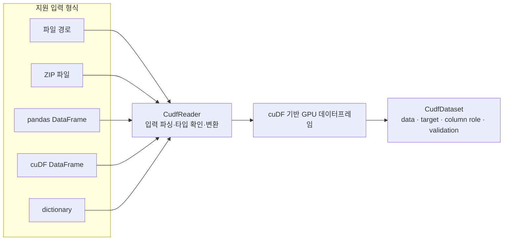

GUAM의 기본 구조가 잡힌 뒤에는 다양한 입력 데이터를 GPU-native Dataset으로 바꾸고 모델이 사용할 피처로 변환하는 계층을 구현했다. CudfDataset과 CudfReader부터 numeric, datetime, target encoding까지 이어지는 작업을 적어본다.

## 1. GUAM의 GPU 데이터 입력 파이프라인

GUAM에서 첫 번째로 해결해야 했던 문제는 모델이 아니라 데이터 입력이었다. 다양한 형태의 데이터를 하나의 GPU-native 데이터셋으로 바꾸는 공통 계층이 필요했다.



### CudfDataset을 만들다

`CudfDataset`은 cuDF 데이터프레임을 GUAM의 파이프라인에서 사용할 수 있도록 감싸는 객체다. 데이터와 target, column role, validation에 필요한 정보를 한곳에서 관리하도록 했다.

또한 입력 데이터가 정말 GPU에서 처리될 수 있는지 확인하는 validation을 추가했다. 타입이 맞지 않거나 target이 누락된 경우에는 학습 단계까지 진행하기 전에 오류를 알려야 한다.

### CudfReader의 역할

Reader는 파일 경로, zip 파일, cuDF, pandas, dictionary 등 여러 입력을 받아 같은 Dataset 형식으로 변환한다.

```text
파일 경로 / pandas / cuDF / dict
                ↓
           CudfReader
                ↓
           CudfDataset
```

사용자는 입력 형식을 편하게 선택할 수 있지만 내부에서는 가능한 한 cuDF로 변환한 뒤 GPU 경계를 유지한다. 특히 pandas에서 cuDF로 변환하는 시점을 한곳으로 모으는 것이 중요했다.

### 실제 데이터로 검증하기

Titanic, BAF, IEEE-CIS처럼 데이터 크기와 컬럼 구성이 다른 Kaggle 데이터셋을 이용해 Reader와 Dataset을 검증했다. 작은 예제만으로는 대규모 데이터에서 발생하는 메모리 문제나 타입 문제를 찾기 어렵기 때문이다.

직접 확인해보니 좋은 AutoML은 모델 목록보다 데이터를 모델까지 안정적으로 전달하는 기반에서 시작되었다.

### 입력 편의성과 내부 규칙의 균형

사용자는 CSV 경로를 넘길 수도 있고 이미 읽어둔 pandas 또는 cuDF 객체를 넘길 수도 있다. 입력 방식을 많이 지원할수록 사용성은 좋아지지만 내부 규칙이 모호해지면 오류가 모델 학습 단계까지 늦게 나타난다.

그래서 Reader에서 가능한 입력을 명확히 분류하고 Dataset 단계에서는 column role과 target의 유효성을 검사하도록 했다. 실패를 일찍 발견하는 것이 디버깅 비용을 줄이는 방법이었다.

Titanic 같은 작은 데이터로 빠르게 확인한 뒤 더 큰 Kaggle 데이터에서 메모리와 타입을 다시 검증했다. 예제 실행과 실제 파이프라인 검증은 서로 다른 단계라는 것을 알게 되었다.

## 2. GUAM의 변환기와 피처 파이프라인 확장하기

모델을 여러 개 연결한 뒤에는 입력 데이터를 모델에 맞게 변환하는 계층을 확장했다. AutoML에서 전처리는 부가 기능이 아니라 모델 성능과 데이터 누수에 직접 영향을 주는 핵심 단계다.

<!-- 이미지 삽입 위치: 원본 컬럼이 여러 Transformer를 거쳐 모델 입력이 되는 흐름도 -->

### 기본 변환기

GUAM에는 수치형, 날짜형, 합성 변환기와 nested target encoding을 추가했다.

| 변환기 | 역할 |
|---|---|
| Numeric transformer | 수치형 컬럼 정리와 스케일링 |
| Datetime transformer | 날짜에서 시간, 요일 등 특징 추출 |
| Composite transformer | 여러 변환기를 순서대로 결합 |
| NestedTargetEncoder | 누수를 막은 target encoding |
| KGMON generator | 합성 피처 생성 |

각 변환기는 동일한 `GUAMTransformer` 계약을 따르도록 했다. 그래야 모델이나 데이터셋이 달라져도 피처 파이프라인을 재사용할 수 있다.

### target encoding에서 특히 조심한 것

target encoding은 범주형 값과 target의 관계를 수치로 바꾸는 유용한 방법이지만 validation 데이터의 target 정보가 학습에 섞이면 데이터 누수가 발생한다.

그래서 nested 방식으로 fold 내부에서만 통계를 계산하도록 설계했다.

```text
train fold에서 encoding 통계 계산
  → validation fold에는 train 통계만 적용
  → 다음 fold에서 같은 방식 반복
```

정확도가 높아 보이는 것보다 실제 운영 환경에서 재현 가능한 변환을 만드는 것이 더 중요했다.

### 피처 파이프라인의 의미

변환기를 하나씩 추가하는 과정은 단순한 전처리 구현이 아니었다. 데이터 누수, GPU 메모리, fit/transform 시점, 컬럼 역할을 모두 함께 다뤄야 했다.

이제 GUAM은 입력 데이터를 읽고 모델을 실행하는 수준에서 데이터의 특성을 자동으로 변환하고 조합하는 방향으로 한 단계 넓어졌다.

### fit과 transform을 분리하는 이유

전처리기는 학습 데이터에서 통계를 계산하는 `fit`과, 계산된 규칙을 적용하는 `transform`을 구분해야 한다. validation 데이터의 정보를 미리 사용하면 성능이 실제보다 높게 보일 수 있기 때문이다.

특히 target encoding은 범주별 target 평균을 사용하는 만큼 누수에 민감했다. fold 내부의 train 데이터로만 통계를 만들고 validation에는 그 결과를 적용하도록 설계했다.

변환기를 하나씩 추가하는 과정은 단순한 전처리 구현이 아니었다. 데이터 누수, GPU 메모리, fit/transform 시점, 컬럼 역할을 모두 함께 다뤄야 했다. 이 계층이 안정되어야 다양한 모델을 연결해도 같은 데이터 규칙을 재사용할 수 있다.

---

데이터를 읽고 변환하는 부분이 정리되면서 GUAM이 실제 모델을 받을 준비가 되었다. 다음 단계에서는 여러 GPU 모델을 같은 계약으로 연결하고, 서로 다른 예측을 어떻게 합칠지 살펴보려고 한다.

끝!
