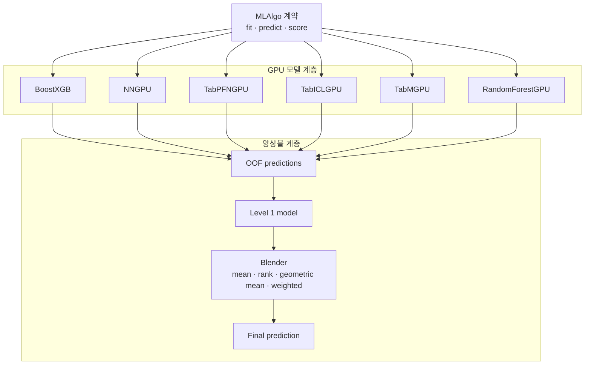

데이터 파이프라인이 어느 정도 정리된 뒤에는 실제 GPU 모델을 연결하고 여러 모델의 예측을 합치는 stacking과 blender를 구현했다. 이후 하이퍼파라미터를 탐색하기 위한 ParamsTuner까지 이어진 과정을 적어본다.

## 1. GUAM에 GPU 모델과 앙상블 추가하기

데이터 입력 계층이 어느 정도 정리된 뒤에는 실제 모델을 추가했다. GUAM은 하나의 알고리즘만 제공하는 라이브러리가 아니라 여러 모델을 동일한 계약으로 실행하고 결과를 결합하는 AutoML 구조를 목표로 한다.



### MLAlgo 계약

각 모델은 학습과 예측 방식을 다르게 구현하지만 외부에서 사용하는 방법은 일정해야 한다.

```text
MLAlgo
  ├─ BoostXGB
  ├─ NNGPU
  ├─ TabPFNGPU
  ├─ TabICLGPU
  ├─ TabMGPU
  └─ RandomForestGPU
```

이 계약을 먼저 만들고 구현체를 추가하니 모델마다 다른 세부사항이 파이프라인 전체로 퍼지는 것을 막을 수 있었다.

### 다양한 GPU 모델을 연결하다

XGBoost GPU 모델은 전통적인 gradient boosting의 장점을 활용하고 NNGPU는 범주형 임베딩과 수치형 전처리를 포함한 신경망 모델이다. TabPFN과 TabICL은 테이블 데이터용 foundation model이라는 점에서 다른 접근을 보여주었다.

모델을 연결하면서 각 라이브러리의 입력 타입과 batch 처리 방식, GPU 메모리 사용량이 서로 다르다는 문제를 만났다. 특히 큰 데이터에서 예측 batch size를 조절하지 않으면 OOM이 발생할 수 있었다.

### stacking과 blender

각 모델의 예측을 단순 평균하는 대신 OOF 예측을 저장해 다음 레벨의 입력으로 사용하는 멀티레벨 stacking을 구현했다. 마지막에는 mean, rank, geometric mean, weighted 방식의 blender를 비교했다.

```text
Level 0 models
  → OOF predictions
  → Level 1 model
  → Blender
  → final prediction
```

앙상블은 모델을 많이 추가하는 것보다 서로 다른 오류를 내는 모델을 조합하는 것이 중요했다. GUAM은 이 과정을 공통 오케스트레이터로 제공하는 방향으로 발전하고 있다.

### 모델을 늘릴수록 계약이 중요해진다

각 모델의 내부 구현은 달라도 파이프라인에서는 같은 방식으로 학습과 예측을 호출할 수 있어야 한다. 이 계약이 없으면 모델마다 전처리와 결과 형식을 따로 처리해야 하고 새로운 모델을 추가할 때마다 AutoML 코드가 복잡해진다.

또한 foundation model 계열은 입력 크기와 batch size에 민감했고 GPU 메모리가 부족할 때 실패하는 방식도 서로 달랐다. 모델을 많이 연결하는 것보다 실패를 예측하고 검증 커널로 확인하는 과정이 더 큰 작업이었다.

직접 만들어보니 앙상블은 여러 모델의 예측값을 평균내는 기능만은 아니었다. 모델마다 다른 오류를 어떻게 관리하고 연결할지 정하는 파이프라인 설계에 가까웠다.

## 2. GUAM의 다음 단계: ParamsTuner 설계하기

GUAM의 데이터 입력, 변환기, 모델, 앙상블 계층이 만들어지면서 다음으로는 하이퍼파라미터 튜닝을 고민하게 되었다. AutoML이 여러 모델을 실행하는 것에서 더 나아가 모델별 설정을 탐색해야 하기 때문이다.

<!-- 이미지 삽입 위치: 탐색 공간에서 trial 결과와 최적 파라미터로 이어지는 흐름도 -->

### 튜너의 역할

튜너는 모델의 모든 파라미터를 직접 아는 대신, 탐색 공간과 평가 함수를 받아 후보를 비교하는 역할을 한다.

```text
탐색 공간 정의
  → 후보 파라미터 생성
  → 모델 학습
  → validation metric 계산
  → 가장 좋은 설정 선택
```

### 기본 계약부터 구현했다

처음부터 Optuna 같은 특정 라이브러리에 강하게 결합하지 않도록 `ParamsTuner`의 기본 계약을 먼저 만들었다. 이후 기본 튜너, Optuna 기반 튜너 등을 같은 인터페이스로 연결할 수 있도록 하기 위해서다.

튜닝은 실행 시간이 길어질 수 있으므로 timeout, seed, 실패한 trial 처리, 결과 저장도 계약에 포함되어야 한다. 좋은 파라미터를 찾는 것만큼 실험을 다시 재현하는 것도 중요하다.

### 앞으로의 과제

튜너는 단독 기능이 아니라 AutoML 파이프라인과 연결되어야 한다. 모델별 search space를 정의하고 stacking과 benchmark 결과에 튜닝 결과를 반영해야 한다.

GUAM은 아직 시작 단계지만 모듈별 계약을 먼저 정해두었기 때문에 새로운 최적화 라이브러리를 추가해도 전체 구조를 크게 바꾸지 않을 수 있다.

### 튜닝에서 함께 관리해야 할 것

하이퍼파라미터 튜닝은 좋은 숫자를 찾는 과정이지만 실행 조건이 바뀌면 결과를 비교할 수 없다. 따라서 seed, validation split, timeout, metric을 함께 기록해야 한다.

또한 하나의 trial이 실패했을 때 전체 탐색을 중단할지 실패한 trial로 기록하고 다음 후보로 넘어갈지도 정해야 한다. GPU OOM이나 잘못된 파라미터는 모델별로 다르게 발생할 수 있기 때문이다.

ParamsTuner의 기본 계약을 먼저 만든 것은 이런 정책을 특정 튜닝 라이브러리 안에 숨기지 않기 위해서였다. 이후 Optuna와 같은 구현체를 연결하더라도 GUAM의 AutoML 파이프라인은 같은 방식으로 튜너를 사용할 수 있어야 한다.

### 탐색 공간의 예시

모델마다 탐색해야 할 파라미터가 다르지만, 튜너가 바라보는 형태는 일정하게 유지할 수 있다.

```python
search_space = {
    "max_depth": [4, 8, 12],
    "learning_rate": [0.03, 0.1],
    "n_estimators": [100, 300],
}
```

실제로는 모든 조합을 실행하는 것보다 시간 제한 안에서 유망한 조합을 선택하는 전략이 필요하다. 데이터셋이 커질수록 trial 하나의 비용도 커지기 때문에 탐색 공간을 넓히는 것과 충분한 평가를 하는 것 사이의 균형이 중요하다.

### 튜닝 결과도 제품의 일부다

최적 파라미터만 저장하면 나중에 왜 그 값이 선택되었는지 알 수 없다. trial별 metric, 실행 시간, 실패 이유, 사용한 데이터 split을 함께 기록해야 한다.

ParamsTuner는 모델 성능을 조금 높이는 부속 기능이 아니라 GUAM에서 실험을 다시 실행하고 개선하는 방법을 정하는 계층이 될 것이다.

---

GUAM은 데이터를 읽는 단계에서 시작해 모델과 앙상블, 튜닝을 연결하는 단계까지 왔다. 아직 완성된 라이브러리는 아니지만 각 계층을 작은 계약으로 나눠두었기 때문에 다음 기능을 추가할 위치는 분명해졌다.

끝!
