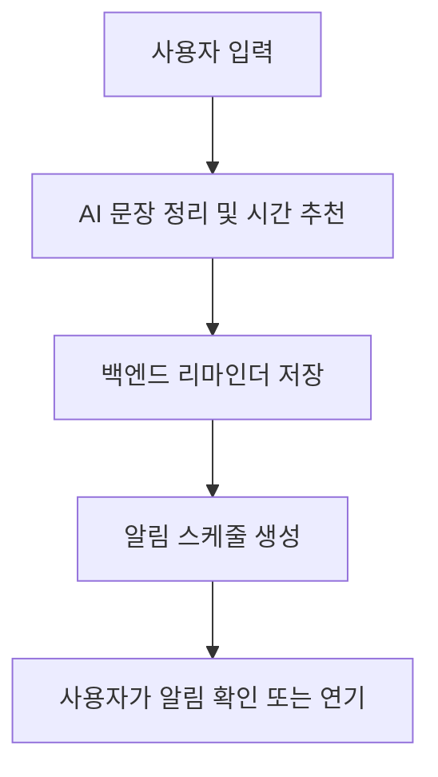
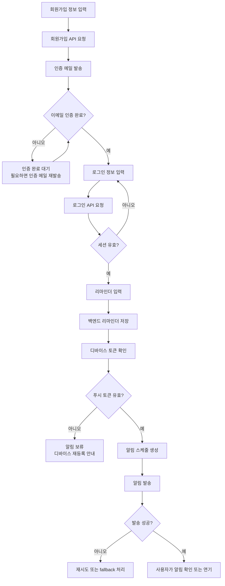

올해 4월부터 Remindy라는 리마인더 앱을 만들기 시작했다. 해야 할 일을 직접 정리하고 알람을 설정하는 방식에서 조금 벗어나 자연어로 입력한 내용을 AI가 정리해 알림으로 연결하는 앱을 만들어보고 싶었다. 초기 화면을 만들고 AI와 인증, 알림을 붙여간 과정을 순서대로 적어본다.

## 1. Remindy 프로젝트의 시작

올해 4월부터 Remindy라는 리마인더 앱을 만들기 시작했다. 해야 할 일을 직접 정리하고 알람을 설정하는 기존 방식에서 조금 벗어나 사용자가 자연어로 일을 입력하면 AI가 알림 시점과 내용을 정리해주는 서비스를 구상했다.


처음부터 완성된 제품을 설계한 것은 아니었다. 작은 화면 하나를 만들고 실제로 눌러보면서 사용자가 어디에서 멈추는지 확인했다. 기능 목록을 먼저 채우기보다 하나의 리마인더가 입력부터 알림까지 이어지는지 확인하는 것을 우선했다.

### 처음에는 작은 앱으로 시작했다

첫 프론트엔드 저장소에는 Expo 기반 앱의 기본 구조와 백엔드 연결부터 담았다. 홈 화면, 리마인더 입력, 상세 화면, 설정 화면을 만들고 실제 API와 연결하는 흐름을 먼저 확인했다.

초기에는 기능을 많이 넣기보다 다음 흐름이 끊기지 않는 것을 우선했다.

1. 앱을 실행한다.
2. 리마인더를 입력한다.
3. 서버에 저장한다.
4. 목록과 상세 화면에서 확인한다.
5. 정해진 시간에 알림을 받는다.

### 제품을 만들면서 달라진 점

처음에는 입력 폼과 API만 연결하면 기능이 완성될 것이라 생각했다. 하지만 실제로는 키보드가 올라왔을 때 버튼이 가려지는 문제, 로딩 중 화면 전환, 삭제 확인, 빈 목록 상태처럼 작은 흐름이 제품의 인상을 좌우했다.

그래서 디자인 레포와 문서 레포를 분리하고 화면별 정책을 함께 기록하기 시작했다. 구현과 디자인, QA 문서가 서로 다른 방향으로 가지 않도록 현재 상태를 계속 동기화했다.

특히 입력 화면은 기능보다 상태가 많았다. 텍스트를 입력하는 중인지, 음성을 처리하는 중인지, 저장 요청을 보낸 상태인지에 따라 버튼과 안내 문구가 달라져야 했다. 처음에는 이 상태들을 화면 안에서 각각 처리했지만, 기능이 늘면서 공통 상태로 정리하는 일이 필요해졌다.

### 서비스의 경계를 정하기

Remindy는 프론트엔드 앱 하나만으로 끝나는 프로젝트가 아니었다. 사용자 인증과 데이터 저장은 백엔드가 담당하고, 문장 정리와 시간 추천은 AI 서비스가 담당하며, 알림은 서버와 디바이스 양쪽에서 동작해야 했다.

이 구조를 일찍 나누면서 각각의 레포가 어떤 책임을 갖는지 문서로 남겼다. 나중에 문제가 발생했을 때 어느 서비스의 책임인지 찾는 비용을 줄이기 위해서다.

### 만들고 싶은 경험

Remindy의 핵심은 알람 기능 자체보다 사용자가 해야 할 일을 잊지 않도록 돕는 것이다. 입력을 간단하게 만들고 알림을 받은 뒤의 행동까지 자연스럽게 이어지도록 만드는 것이 중요했다.

작은 앱이지만 프론트엔드, 백엔드, AI 서비스, 배포, 디자인, 운영 문서를 함께 다루는 프로젝트가 되었다. 기능을 만드는 일과 제품을 운영할 준비를 따로 떼어놓고 생각하기 어렵다는 것을 알게 되었다.

처음부터 완벽한 구조를 만드는 것보다 실제 사용 흐름을 빠르게 확인한 뒤 문제가 드러난 경계를 다시 설계하는 방식이 지금의 프로젝트에 더 잘 맞았다.

## 2. Remindy의 핵심 경험 만들기: AI 리마인더와 알림

Remindy에서 가장 중요한 기능은 사용자가 입력한 문장을 실제 알림으로 연결하는 것이다. 예를 들어 “내일 오전에 병원 예약 확인하기”라는 문장을 입력하면, 앱은 내용을 정리하고 적절한 알림 시간을 제안해야 한다.

<div style="display: flex; gap: 1rem; justify-content: center; flex-wrap: wrap;">
  
  
</div>

이 기능을 만들 때 가장 먼저 고민한 것은 AI가 얼마나 똑똑한가보다 AI의 결과를 사용자가 어떻게 확인하는가였다. 추천 시간이 잘못되었을 때 바로 수정할 수 있어야 하고 아직 처리 중인 상태와 실패한 상태도 서로 다르게 보여야 했다.

### 입력 경험을 먼저 다듬었다

음성 입력과 텍스트 입력을 함께 지원하기 위해 composer를 만들었다. 긴 문장을 입력할 때 입력창이 자연스럽게 확장되고 키보드와 하단 액션 영역이 서로 겹치지 않도록 여러 번 조정했다.

입력창 하나를 만드는 데도 다음과 같은 상태가 필요했다.

- 입력 중
- 음성 녹음 중
- AI가 내용을 정리하는 중
- 저장 중
- 저장 완료
- 오류 또는 재시도 가능 상태

### 알림을 단순한 시간값으로 보지 않기

AI 서비스는 문장에서 날짜와 시간을 추출하고 백엔드는 알림 정책에 맞춰 실제 notification을 생성한다. 프론트엔드에서는 저장 직후 생성될 알림 시간을 보여주고 사용자가 결과를 이해할 수 있도록 도움말을 제공했다.



알림이 정확히 동작하려면 앱, 백엔드, AI 서비스, 디바이스 토큰이 모두 연결되어야 한다. 어느 한 곳의 응답이 늦거나 실패했을 때도 사용자가 앱을 사용할 수 있어야 했다.

### 실패 상태를 제품 흐름에 넣기

AI 요청이 timeout되면 사용자는 단순히 “오류가 발생했습니다”라는 문구만 보게 된다. 하지만 알림 앱에서는 사용자가 직접 시간을 입력해서 저장을 완료할 수 있는 대체 경로가 필요하다.

- AI 처리 중에는 진행 상태를 보여준다.
- 추천 결과를 받으면 사용자가 수정할 수 있게 한다.
- 시간이 추출되지 않으면 직접 시간 선택으로 전환한다.
- 저장 실패 시 입력 내용을 잃지 않고 재시도한다.

이런 fallback을 구현하면서 AI 기능은 정상 경로와 예외 경로를 함께 설계해야 한다는 것을 알게 되었다.

### 제품을 만드는 관점

AI 기능은 모델 호출만 붙인다고 끝나지 않는다. 사용자가 AI가 제안한 시간을 믿을 수 있도록 결과를 보여주고 틀렸을 때 직접 수정할 수 있어야 한다.

직접 만들어보니 AI 기능에서 중요한 것은 모델의 능력만이 아니었다. 입력하는 순간부터 결과를 확인하고 실패했을 때 다시 시도하는 과정까지 함께 만들어야 했다. 사용자가 AI를 믿고 쓰려면 결과를 설명하고 직접 수정할 수 있는 UI도 필요했다.

## 3. Remindy 인증과 알림 시스템 연결하기

Remindy의 기본 입력 흐름이 만들어진 뒤에는 실제 사용자를 고려한 인증과 알림 시스템을 붙였다. 앱이 동작하는 것과 사용자가 안전하게 서비스를 이용할 수 있는 것은 다른 문제였다.



초기에는 개발을 빠르게 진행하기 위해 임시 로그인과 단순한 API 호출을 사용했다. 그러나 여러 디바이스와 실제 사용자 상태를 고려하자 인증 상태, 세션 만료, 디바이스 토큰을 별도로 다뤄야 했다.

### 이메일 인증 흐름

회원가입과 로그인 화면을 구현하면서 인증 상태를 명확히 나누었다.

- 회원가입 입력
- 인증 메일 발송
- 인증 완료 대기
- 로그인
- 세션 만료 및 재인증

사용자가 회원가입을 완료했는데도 앱이 바로 로그인된 것처럼 보이거나 인증 완료 화면을 벗어나지 못하면 전체 경험이 어색해진다. 그래서 프론트엔드에서는 인증 상태에 따라 화면을 유지하고 백엔드에서는 세션과 사용자 상태를 확인하도록 했다.

### AI 요청은 백엔드를 통과하도록 바꾸었다

초기에는 앱에서 AI 서비스를 직접 호출하는 방식을 생각했지만 인증과 환경변수, 오류 처리를 고려하면 백엔드 프록시가 더 적합했다.

```text
Frontend → Backend API → AI Service
```

이 구조를 사용하면 AI 서비스 주소와 인증 정보를 앱에 노출하지 않고 백엔드에서 요청 timeout과 응답 형식을 통일할 수 있다.

백엔드 프록시는 보안만을 위한 계층이 아니었다. 프론트엔드가 AI 서비스의 내부 응답 형식에 직접 의존하지 않게 해주었고 이후 프롬프트나 모델을 변경해도 앱의 계약을 유지할 수 있게 했다.

### 알림은 실패할 수 있다는 전제로 설계했다

푸시 토큰이 없거나 디바이스가 비활성화되었거나 외부 알림 서비스 응답이 실패할 수 있다. 따라서 알림 생성과 발송을 하나의 성공, 실패로만 판단하지 않고 재시도, fallback, 디바이스 상태를 따로 관리하기 시작했다.

작업하면서 서비스의 인상은 정상적으로 동작할 때보다 실패했을 때 사용자가 무엇을 보게 되는지에 더 크게 좌우된다는 것을 느꼈다.

### 인증과 알림을 함께 보며

인증이 완성되어야 사용자의 리마인더를 안전하게 저장할 수 있고 디바이스가 등록되어야 알림을 보낼 수 있다. 각각의 기능을 따로 구현하는 것처럼 보여도 실제 제품에서는 하나의 사용자 흐름으로 연결되어 있었다.

화면을 만드는 데서 시작했지만 이때부터는 서비스의 신뢰 경계와 각 레포의 책임까지 함께 생각하게 되었다.

---

Remindy는 작은 입력 화면에서 시작했지만 실제로는 앱, 백엔드, AI 서비스, 알림 시스템이 함께 움직여야 하는 프로젝트였다. 처음부터 모든 것을 완성하려 하기보다 하나의 흐름을 만들고 문제가 보일 때마다 다음 구조를 붙여가는 방식으로 계속 만들어보려고 한다.

끝!
