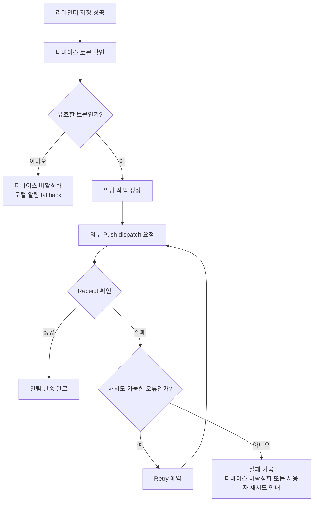

Remindy의 기본 기능이 돌아가기 시작하자 네트워크가 끊겼을 때와 알림 발송이 실패했을 때를 살펴보기 시작했다. 캐시와 동기화, 알림 retry와 fallback, AI 추천 태그를 적용하면서 겪었던 문제를 한 흐름으로 적어본다.

## 1. Remindy를 오프라인 우선 앱으로 바꾸기

Remindy를 실제로 사용해보면서 네트워크가 항상 안정적이지 않다는 문제를 마주했다. 목록을 조회하거나 리마인더를 저장할 때 네트워크가 잠깐 끊기면 앱 전체가 멈춘 것처럼 보였다.

그래서 앱을 서버 응답을 기다리는 구조에서 로컬을 먼저 사용하는 구조로 변경하기 시작했다.

### 읽기는 캐시를 먼저 확인한다

리마인더 목록을 열 때마다 서버 응답을 기다리는 대신 로컬에 저장된 데이터를 먼저 보여준다.

```text
화면 진입
  → local cache 표시
  → 백그라운드 동기화
  → 변경된 데이터 반영
```

사용자는 빠르게 화면을 볼 수 있고 서버에 최신 데이터가 있으면 뒤에서 갱신된다. 단, 캐시가 언제 최신인지와 동기화 중인지 화면에 알려줄 필요가 있다.

### 쓰기는 작업 큐에 보관한다

리마인더 생성, 수정, 삭제를 서버 요청이 성공할 때까지 기다리게 하지 않고 먼저 로컬 상태에 반영한 뒤 pending operation으로 저장했다.

```text
사용자 작업
  → 로컬 상태 즉시 반영
  → pending queue 저장
  → 네트워크 복구 후 서버 동기화
  → 성공한 작업 제거
```

이 과정에서는 offline id와 서버 id를 매핑해야 하고 같은 항목에 여러 작업이 쌓였을 때 순서를 보장해야 한다.

### 어려웠던 점

오프라인 기능은 단순히 네트워크 오류를 무시하는 기능이 아니었다. 로컬과 서버의 상태가 달라질 수 있고 동기화 실패와 재시도를 사용자가 이해할 수 있어야 한다.

### 동기화 충돌을 어떻게 볼 것인가

로컬에서 수정한 리마인더가 서버에서도 동시에 수정될 수 있다. 이때 무조건 최신 시간의 값을 선택하면 사용자의 의도와 다른 변경이 사라질 수 있다. 아직 모든 충돌 해결 정책을 완성한 것은 아니지만 작업의 순서와 동기화 상태를 기록하는 구조를 먼저 마련했다.

또한 pending 작업이 쌓였을 때 사용자가 현재 상태를 알 수 있도록 동기화 배지와 재시도 흐름을 추가했다. 오프라인 기능은 내부적으로만 작동해서는 충분하지 않고 사용자에게도 현재 앱이 어떤 상태인지 설명해야 했다.

직접 만들어보니 앱의 신뢰성은 서버가 빠를 때보다 네트워크가 불안정할 때 더 잘 드러났다.

## 2. Remindy 알림 시스템의 실패를 다루는 방법

리마인더 앱에서 가장 치명적인 실패는 알림이 오지 않는 것이다. 저장 API가 잠깐 실패하는 것보다 사용자가 약속한 시간에 알림을 받지 못하는 문제가 더 큰 신뢰 하락으로 이어진다.



### 알림 발송은 한 번의 요청이 아니다

알림은 다음 여러 단계를 거친다.

```text
리마인더 저장
  → 디바이스 토큰 확인
  → 알림 작업 생성
  → 외부 push service 요청
  → receipt 확인
  → 실패 시 retry 또는 디바이스 비활성화
```

각 단계의 성공 여부를 따로 기록해야 어디에서 문제가 발생했는지 알 수 있다.

### retry와 fallback

일시적인 네트워크 오류는 재시도할 수 있지만 잘못된 토큰이나 만료된 디바이스는 계속 재시도해도 해결되지 않는다. 그래서 오류 종류에 따라 재시도 가능한 오류와 디바이스를 비활성화해야 하는 오류를 나누었다.

앱이 오프라인인 경우에는 로컬 알림을 활용하고 서버 알림과 앱 내부 알림이 중복되지 않도록 정책을 문서화했다.

### 사용자에게 상태를 보여주기

시스템 내부에서 retry가 진행되어도 사용자는 알림이 생성되었는지 알 수 없다. 리마인더 상세 화면에 예정된 알림 시간을 보여주고 오류가 있을 때 다시 시도할 수 있는 흐름을 마련했다.

기능이 정상적으로 동작하는 것만큼 실패했을 때 사용자가 상황을 이해할 수 있게 만드는 것이 중요했다.

### 로컬 알림과 서버 알림의 경계

오프라인 상태에서도 예정된 알림을 보여주려면 디바이스에 로컬 알림을 예약할 수 있어야 한다. 하지만 서버에서도 같은 알림이 발송되면 중복 알림이 발생할 수 있다.

그래서 어떤 알림을 서버가 책임지고 어떤 알림을 디바이스가 보조하는지 정책을 문서로 정리했다. 구현이 먼저 진행되면 나중에 중복 발송을 고치기 어렵기 때문에 알림의 source와 상태를 구분해서 기록하는 방향으로 접근했다.

알림 시스템을 만들면서 성공 상태도 하나가 아니라는 것을 알게 되었다. 저장 성공, 예약 성공, 발송 요청 성공, 실제 receipt 성공을 나누어 보아야 사용자가 왜 알림을 받지 못했는지 설명할 수 있다.

## 3. Remindy 안정화하기: 로컬 우선 저장과 태그 기능

Remindy의 오프라인 흐름을 구현한 뒤에는 실제 화면마다 캐시 우선 정책을 적용했다. 목록, 설정, 완료 보관함, 알림 확인 화면이 각각 다른 방식으로 동작하면 사용자가 앱의 상태를 이해하기 어렵기 때문이다.

### 화면마다 같은 원칙을 적용하다

- 목록은 캐시된 리마인더를 먼저 보여준다.
- 설정 화면은 로컬 설정을 먼저 표시한다.
- 완료 보관함도 네트워크 응답을 기다리지 않는다.
- 동기화 중에는 pending 상태를 표시한다.
- 실패하면 재시도할 수 있는 상태를 남긴다.

이 정책을 문서에 먼저 정리하고 프론트엔드에 반영했다. 구현과 문서의 기준이 달라지면 다음 기능을 추가할 때 같은 문제가 반복되기 때문이다.

### AI 추천 태그

리마인더를 주제별로 관리할 수 있도록 태그 기능을 추가했다. AI가 추천한 태그 후보를 화면에 미리 선택된 상태로 보여주고 사용자가 수정할 수 있도록 했다.

AI가 결정한 값을 그대로 저장하는 것이 아니라 사용자가 확인하고 조정할 수 있게 하는 것이 중요했다. 추천은 자동화하지만 최종 통제권은 사용자에게 남겨야 한다.

### 작은 UX 문제를 함께 해결하다

태그가 없는 리마인더를 수정할 때의 크래시, 키보드가 하단 액션을 가리는 문제, 삭제 모달의 접근 위치 등도 함께 수정했다. 기능 목록에는 잘 드러나지 않지만 이런 부분이 앱의 완성도를 결정한다.

직접 만들어보니 로컬 우선 구조는 저장 방식만 바꾸는 일이 아니었다. 화면에 어떤 상태를 보여줄지와 사용자가 동기화 결과를 어떻게 이해할지까지 함께 정해야 했다.

### 자동 추천과 사용자 통제

AI 추천 태그를 추가하면서 자동화된 값이 항상 정답은 아니라는 점도 다시 확인했다. 추천 후보를 보여주되 사용자가 선택을 해제하거나 새로운 태그를 추가할 수 있어야 했다.

이 원칙은 시간 추천 기능과도 같았다. AI가 처음부터 완벽한 결과를 반환하도록 기대하기보다 사용자가 빠르게 확인하고 수정할 수 있도록 만드는 것이 제품에 더 적합했다.

오프라인 저장, 캐시 우선 조회, AI 태그 추천은 서로 별개의 기능처럼 보이지만 모두 사용자의 흐름을 기다리게 하지 않는다는 방향으로 연결되어 있었다.

### 동기화 상태를 화면에 표현하기

로컬 우선 앱에서는 데이터 자체뿐 아니라 데이터의 상태도 중요하다.

| 상태 | 사용자가 보게 되는 의미 |
|---|---|
| synced | 서버와 동기화된 상태 |
| pending | 로컬에는 저장되었지만 서버 반영 대기 |
| syncing | 서버와 동기화 중 |
| failed | 서버 반영에 실패해 재시도 필요 |

이 상태를 내부 로그에만 남기면 사용자는 앱이 정상인지 알 수 없다. 반대로 모든 처리 과정을 크게 표시하면 화면이 복잡해질 수 있어 필요한 순간에만 배지와 토스트로 안내하는 균형을 잡아야 했다.

### 기능보다 정책이 먼저였다

캐시를 언제 지울지, 서버 데이터와 충돌하면 무엇을 우선할지, 로그아웃할 때 로컬 데이터는 어떻게 처리할지 같은 정책을 먼저 정리해야 했다. 구현은 그 뒤에야 일관되게 진행되었다.

이번 작업은 저장소를 바꾼 작업이면서 동시에 앱이 사용자에게 약속하는 상태를 다시 정의한 작업이었다.

---

오프라인 저장과 알림 fallback을 붙이면서 앱은 정상적인 네트워크만을 전제로 만들 수 없다는 것을 알게 되었다. 사용자가 어떤 상태에서 앱을 열더라도 지금 무슨 일이 일어나고 있는지 알 수 있게 만드는 것이 다음 과제다.

끝!
