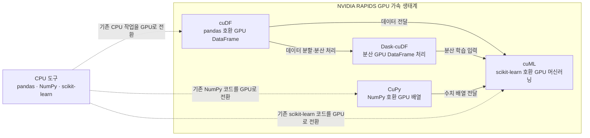

RAPIDS를 공부하면서 GPU 기반 데이터 분석과 머신러닝을 처음부터 다시 살펴보았다. GPU를 왜 써야 하는지부터 cuDF와 cuML이 어떤 방식으로 동작하는지와 기존에 사용하던 scikit-learn 기반으로 구현한 XGBoost와 무엇이 다른지 차례대로 적어보려고 한다.

## 1. 2026년 RAPIDS 공부를 시작하며

> 올해는 데이터를 더 빠르게 다루는 방법을 공부해보기로 했다.

2026년을 시작하면서 모두의 연구소 NVIDIA RAPIDS Lab에 참여했다. 그동안 pandas와 scikit-learn을 이용해 데이터를 다루는 데 익숙했지만 데이터가 커질수록 CPU와 메모리만으로는 한계가 있다는 생각이 들었다.

RAPIDS는 NVIDIA GPU를 활용해 데이터 분석과 머신러닝 작업을 가속하는 오픈소스 생태계다. 단순히 기존 라이브러리의 속도를 높이는 도구라고만 생각했는데 실제로는 데이터프레임부터 머신러닝, 분산 처리까지 서로 이어져 있었다.



처음부터 특정 모델의 성능을 확인하려고 하기보다, GPU에서 데이터가 어떻게 이동하는지 이해하는 것을 학습의 첫 목표로 정했다. CPU에서 익숙하게 사용하던 코드를 GPU 환경으로 옮겼을 때 어떤 부분이 그대로 유지되고 어떤 부분이 달라지는지 확인하고 싶었다.

### RAPIDS에서 먼저 살펴본 것

| 도구 | 역할 | 익숙한 도구와 비교 |
|---|---|---|
| cuDF | GPU 데이터프레임 | pandas |
| CuPy | GPU 배열 연산 | NumPy |
| cuML | GPU 머신러닝 | scikit-learn |
| Dask-cuDF | 분산 GPU 데이터 처리 | Dask, pandas |
| cuVS | GPU 벡터 검색 | FAISS 등 |

처음에는 pandas 코드를 cuDF로 바꾸면 되는 정도로 생각했다. 하지만 GPU에서는 데이터가 어느 메모리에 있는지, CPU와 GPU 사이에 데이터가 얼마나 자주 이동하는지가 성능에 직접적인 영향을 준다.

> 데이터를 GPU에 올려놓고 다시 CPU로 가져오면 GPU를 사용하는 의미가 줄어든다.
{: .prompt-tip }

### 환경을 먼저 이해해야 했다

RAPIDS는 일반적인 Python 패키지 하나를 설치하는 것과는 조금 달랐다. CUDA 버전, NVIDIA 드라이버, Python 버전이 서로 맞아야 했고 GPU가 실제로 인식되는지도 확인해야 했다.

```bash
python -c "import cudf; print(cudf.__version__)"
python -c "import cupy; print(cupy.cuda.runtime.getDeviceCount())"
```

환경이 준비되어 있지 않으면 코드가 실행되지 않는 문제가 먼저 발생한다. 그래서 올해 공부에서는 알고리즘을 바로 시작하기보다 환경 구성, 데이터 이동, CPU와 GPU의 경계부터 확인하는 순서로 진행하기로 했다.

### 공부하면서 생각한 것

GPU 가속은 단순히 하드웨어를 바꾸는 일이 아니었다. 데이터를 어떤 형식으로 읽고 중간 결과를 어떤 자료구조로 유지하며 라이브러리 사이의 변환을 얼마나 줄일 것인지까지 함께 설계해야 했다.

올해 RAPIDS 학습은 이후 AutoML을 GPU 위에서 구현하는 GUAM 프로젝트로 이어질 예정이다. 처음에는 라이브러리 사용법을 익혀보고 이후 데이터 준비부터 모델 학습과 앙상블까지 전체 파이프라인을 GPU에 남겨두는 문제로 확장하고자 한다.

### CPU와 GPU 사이의 경계

GPU를 사용하면 모든 코드가 자동으로 빨라질 것 같지만 실제로는 그렇지 않았다. 작은 데이터에서는 GPU로 데이터를 옮기는 비용이 계산 시간보다 커질 수 있고 중간에 pandas로 변환하면 다시 CPU 메모리로 이동하게 된다.

따라서 다음과 같은 질문을 반복해서 확인했다.

- 현재 데이터는 CPU와 GPU 중 어디에 있는가?
- 이 연산은 GPU에서 지원되는가?
- 결과를 확인하기 위해 불필요하게 CPU로 복사하고 있지는 않은가?
- 여러 라이브러리를 연결할 때 데이터 타입이 바뀌지는 않는가?

이 기반 위에서 AutoML을 공부하고 직접 GPU 파이프라인을 구현해보려고 한다.

## 2. GPU 데이터 분석 도구 비교하기

RAPIDS를 공부하면서 가장 먼저 궁금했던 것은 기존에 사용하던 머신러닝 도구와 실제로 어떤 차이가 있는지였다. 그래서 scikit-learn과 XGBoost를 기준으로 cuML과 GPU 기반 XGBoost를 비교해보았다.

> [실습 내용](https://github.com/annmunju/annmunju/tree/main/TIL/2026/RAPIDS/1_RAPIDS_study)

이번 비교의 목적은 어느 라이브러리가 항상 더 좋은지 결론을 내리는 것이 아니었다. 데이터 크기와 모델, 입력 형식에 따라 어떤 선택이 적합한지 판단할 수 있는 기준을 만들어보는 데 의미를 두었다.

### API는 비슷하지만 실행 위치가 다르다

cuML은 scikit-learn과 비슷한 API를 제공한다. 모델을 만들고 `fit`, `predict`를 호출하는 흐름은 익숙했지만, 데이터가 GPU 메모리에 있다는 전제가 추가된다.

```python
from cuml.ensemble import RandomForestClassifier

model = RandomForestClassifier(n_estimators=100)
model.fit(X_train, y_train)
pred = model.predict(X_test)
```

겉으로는 코드가 짧지만 내부적으로는 데이터 타입과 메모리 위치를 계속 확인해야 했다. pandas 데이터프레임을 그대로 넘길 수 있는 경우도 있지만 반복적인 변환이 들어가면 GPU 가속의 이점이 사라질 수 있다.

### XGBoost에서도 GPU 설정이 중요하다

XGBoost는 CPU에서도 많이 사용하는 모델이지만 GPU 학습 옵션을 사용하면 대규모 데이터에서 다른 실행 특성을 보인다.

```python
params = {
    "tree_method": "hist",
    "device": "cuda",
}
```

여기서 중요한 점은 GPU를 사용한다고 선언하는 것만으로 끝나지 않는다는 것이다. 입력 데이터가 어떤 형식인지나 평가 지표가 CPU에서 실행되고 있지는 않은지, 학습 중간에 불필요한 복사가 일어나지는 않는지까지 확인해야 한다.

### 사용하면서 느낀 차이

| 기준 | CPU 중심 접근 | GPU 중심 접근 |
|---|---|---|
| 장점 | 설치와 디버깅이 쉽다 | 반복 연산과 대규모 데이터에 유리하다 |
| 주의점 | 데이터가 커지면 시간이 길어진다 | CUDA와 메모리 경계를 관리해야 한다 |
| 설계 기준 | 모델 중심 | 데이터 이동과 파이프라인 중심 |

작은 데이터에서는 GPU 전송 비용 때문에 오히려 차이가 크지 않을 수 있다. 결국 GPU를 사용하는 목적은 단순히 한 번의 학습 시간을 줄이는 것이 아니라 큰 데이터를 반복해서 처리하는 전체 실험 시간을 줄이는 데 있다.

### 작은 데이터에서의 함정

작은 데이터셋을 이용해 같은 코드를 실행했을 때 GPU 버전이 항상 빠르지는 않았다. 입력 데이터를 GPU로 복사하고 결과를 다시 CPU로 가져오는 과정이 포함되기 때문이다.

반대로 행 수가 많거나 같은 데이터를 여러 번 반복해서 처리하는 경우에는 GPU의 병렬성이 의미를 갖기 시작했다. 결국 GPU를 쓰면 빠르다고 할 수는 없지만 반복되는 큰 연산을 GPU에 두고 작업하는게 유리하다고 보았다.

### AutoML

모델 하나의 학습 시간을 줄이는 것보다 더 어려운 문제는 여러 모델을 같은 조건에서 비교하는 것이다. 모델마다 입력 타입과 GPU 지원 여부가 다르고 평가 지표가 CPU에서 실행되면 파이프라인 전체가 다시 느려질 수 있다.

이번 비교를 통해 이후 AutoML을 구현할 때 모델만 GPU로 바꾸는 방식으로는 부족하다는 것을 알게 되었다. 데이터셋, 변환기, 검증기, 평가 지표까지 같은 실행 경계를 가져야 했다.

---

GPU를 공부하면서 단순히 실행 시간을 줄이는 것보다 데이터가 어디에 있고 어떻게 이동하는지를 먼저 봐야 한다는 것을 알게 되었다. 이 개념을 가지고 이후 GPU 위에서 동작하는 AutoML 프로젝트를 직접 만들때 충분히 고려해야할 것이다.

끝!
